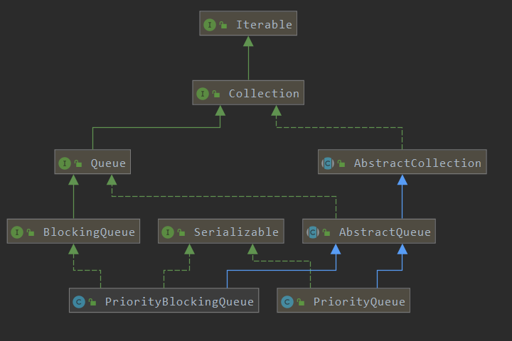
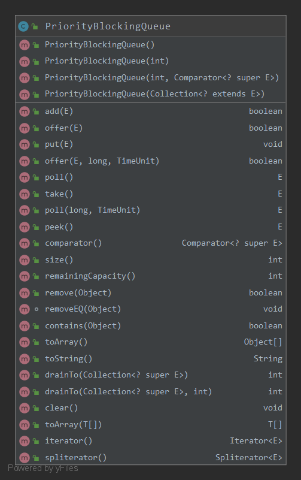

> 从PriorityBlockingQueue的`概念，结构，参数，源码解析（offer,poll,remove,add,grow），性能，线程安全性，使用场景，常见问题`8个方面进行分析。

> An unbounded BlockingQueue blocking queue that uses the `same ordering rules as class PriorityQueue` and supplies `blocking retrieval operations`.  
* While this queue is logically unbounded, attempted additions may fail due to resource exhaustion (causing OutOfMemoryError). 
* This class does not permit null elements.  
* A priority queue relying on `Comparable natural ordering` also does not permit insertion of `non-comparable` objects (doing so results in ClassCastException).
* This class and its iterator implement all of the optional methods of the Collection and Iterator interfaces.  
* The Iterator provided in method iterator() is `not guaranteed` to traverse the elements of the PriorityBlockingQueue in any particular `order`. If you need ordered traversal, consider using `Arrays.sort(pq.toArray())`.  Also, method drainTo can be used to remove some or all elements in priority  order and place them in another collection.
* Operations on this class make `no guarantees` about the `ordering` of elements with `equal priority`. 
If you need to enforce an ordering, you can define custom classes or comparators that use a secondary key to break ties in primary priority values. 

For example, here is a class that applies `first-in-first-out` tie-breaking to comparable elements. To use it, you would insert a
 `new FIFOEntry(anEntry)` instead of a plain entry object.
 ```java
 class FIFOEntry<E extends Comparable<? super E>>  implements Comparable<FIFOEntry<E>> {
    static final AtomicLong seq = new AtomicLong(0);
    final long seqNum;
    final E entry;
    public FIFOEntry(E entry) {
      seqNum = seq.getAndIncrement();
      this.entry = entry;
    }
    
    public E getEntry() { return entry; }

    public int compareTo(FIFOEntry<E> other) {
      int res = entry.compareTo(other.entry);
      if (res == 0 && other.entry != this.entry)
        res = (seqNum < other.seqNum ? -1 : 1);
      return res;
    }
 }}
 ```
 * This class is a member of the Java Collections Framework

>关键点：与PriorityQueue一样的排序规则，无界队列，实现Queue,Collection,Iterator接口、不允许null键/值、提供阻塞操作、线程安全、不保证队列内元素的顺序；

<!-- more --> 
# 概念


>PriorityQueue的类关系



>PriorityQueue的类成员



# 结构
二叉堆实现，参考[PriorityQueue](https://github.com/geosmart/geosmart.io/blob/master/blog/JDK-PriorityQueue%E5%8E%9F%E7%90%86.md)

# 参数
* `int.initialCapacity`：初始化容量，默认为`11`；
* `Comparator.comparator`:用于队列中元素排序；
* `int.size`:记录队列中元素个数；
* `ReentrantLock.lock`:用于所有public方法操作的加锁；
* `Condition.notEmpty`:用于阻塞对空队列的操作；
* `int.allocationSpinLock`: 队列扩容时用于CAS；
* `PriorityQueue.q`：用PriorityQueue进行序列化和反序列化；

* 构造函数：新建1个空的队列；
```java

    public PriorityBlockingQueue(int initialCapacity,Comparator<? super E> comparator) {
        if (initialCapacity < 1)
            throw new IllegalArgumentException();
        this.lock = new ReentrantLock();
        this.notEmpty = lock.newCondition();
        this.comparator = comparator;
        this.queue = new Object[initialCapacity];
    }
``` 
# 源码解析 
The implementation uses an `array-based binary heap`, with public operations protected with a `single lock`. However, allocation during resizing uses a simple `spinlock` (used only while not holding main lock) in order to allow takes to operate concurrently with allocation.  
This avoids repeated postponement of waiting consumers and consequent element build-up. The need to back away from lock during allocation makes it impossible to simply wrap delegated `java.util.PriorityQueue` operations within a lock, as was done in a previous version of this class. To maintain interoperability, a plain PriorityQueue is still used during serialization, which maintains compatibility at the expense of transiently doubling overhead.
> TODO 搞清楚spinLock间隙锁

## heapify
参考[PriorityQueue](https://github.com/geosmart/geosmart.io/blob/master/blog/JDK-PriorityQueue%E5%8E%9F%E7%90%86.md)
从最后一个父节点开始siftdown，直到根节点

## add/put/offer
```java
 /**
     * Inserts the specified element into this priority queue.
     */
    public boolean add(E e) {
        return offer(e);
    }


    /**
     * Inserts the specified element into this priority queue.
     * As the queue is unbounded, this method will never block.
     */
    public void put(E e) {
        offer(e); // never need to block
    }

    /**
     * Inserts the specified element into this priority queue.
     * As the queue is unbounded, this method will never block or return false.
     */
    public boolean offer(E e, long timeout, TimeUnit unit) {
        return offer(e); // never need to block
    }
    
    @Override
    public boolean offer(E e) {
        if (e == null) {
            throw new NullPointerException();
        }
        final ReentrantLock lock = this.lock;
        //加锁
        lock.lock();
        int n, cap;
        Object[] array;
        //如果队列元素个数>=队列容量，则扩容
        while ((n = size) >= (cap = (array = queue).length)) {
            tryGrow(array, cap);
        }
        try {
            Comparator<? super E> cmp = comparator;
            if (cmp == null) {
                //上浮
                siftUpComparable(n, e, array);
            } else {
                siftUpUsingComparator(n, e, array, cmp);
            }
            size = n + 1;
            //设置notEmpty条件
            notEmpty.signal();
        } finally {
            //解锁
            lock.unlock();
        }
        return true;
    }
```
>siftUp参考[JDK-PriorityQueue原理](https://github.com/geosmart/geosmart.io/issues/12)

>tryGrow扩容要点
* lock是全局锁，如果在扩容时加锁会导致其他线程出/入队时都会阻塞；
* 而队列很大时，扩容操作（arraycopy）是比较费时的，如果此时占用锁，那么其他线程在这个时候是不能进行出/入队操作，这样会`降低并发处理能力`；
* 所以为了更好的性能，扩容时先释放锁；
* 但是释放锁后，会导致多个线程同时进行扩容，此时用spinLock以`CAS`控制只有1个线程可以执行扩容，其他CAS失败的则跳过（newArray=null）；
* CAS失败的线程调用`Thread.yield()`让出CPU时间，目的是让让CAS成功的线程扩容后优先调用lock.lock重新获取锁，但是这得不到一定的保证，有可能调用Thread.yield()的线程先获取了锁；
* 在扩容时，若其他线程在执行了出/入队操作，直接cop扩容y会导致copy的不是最新的数据，所以此时要加锁后再copy；
* 在加锁时，如果其他线程执行出了/如队操作，队列发生了变化（queue != array），当前扩容操作要取消；如果成功加锁且队列没发生改变，则可执行扩容操作；
>关键点：解全局锁，CAS乐观锁申请数组大小，扩容前恢复加锁

```java
 /**
     * Tries to grow array to accommodate at least one more element  (but normally expand by about 50%),
     * giving up (allowing retry) on contention (which we expect to be rare).
     * Call only while  holding lock.
     *
     * @param array  the heap array
     * @param oldCap the length of the array
     */
    private void tryGrow(Object[] array, int oldCap) {
        // must release and then re-acquire main lock
        //1. lock是全局锁，为了更好的性能，扩容时先释放锁，避免其他线程出/入队时造成阻塞
        //队列很大时，扩容操作（arraycopy）是比较费时的，如果此时占用锁，那么其他线程在这个时候是不能进行出/入队操作，这样会降低并发处理能力。
        //释放锁，会导致多个线程同时进行扩容，此时用spinLock以CAS控制只有1个线程可以执行扩容
        lock.unlock();
        Object[] newArray = null;
        //2. 并发通过乐观锁CAS控制扩容，只有1个线程会CAS成功并扩容，其他CAS失败的则跳过（newArray=null）
        if (allocationSpinLock == 0 &&
                UNSAFE.compareAndSwapInt(this, allocationSpinLockOffset, 0, 1)) {
            try {
                //设置扩容比例，小于64时2倍，大于64后1.5倍, grow faster if small
                int newCap = oldCap + ((oldCap < 64) ?
                        (oldCap + 2) :
                        (oldCap >> 1));
                //处理大小越界
                if (newCap - MAX_ARRAY_SIZE > 0) {
                    // possible overflow
                    int minCap = oldCap + 1;
                    if (minCap < 0 || minCap > MAX_ARRAY_SIZE) {
                        throw new OutOfMemoryError();
                    }
                    newCap = MAX_ARRAY_SIZE;
                }
                //3. 如果其他线程没有对队列进行改变，直接新建数组；如果其他线程可能执行了出/入队操作，则当前线程不需要扩容，所以要加上queue == array判断
                if (newCap > oldCap && queue == array) {
                    newArray = new Object[newCap];
                }
            } finally {
                //重置SpinLock状态
                allocationSpinLock = 0;
            }
        }
        // back off if another thread is allocating
        //4. CAS失败的线程调用Thread.yield()让出CPU时间，目的是让CAS成功的线程扩容后优先调用lock.lock重新获取锁，但是这得不到一定的保证，有可能调用Thread.yield()的线程先获取了锁。
        if (newArray == null) {
            Thread.yield();
        }
        //5. 在扩容时，若其他线程在执行出/入队操作，直接copy会导致copy的不是最新的数据，所以此时要加锁后再copy
        lock.lock();
        //6. 加锁时，如果其他线程执行出/入队操作，队列发生了变化（queue!= array），当前扩容操作要取消；如果成功加锁且队列没发生改变，则可执行扩容操作
        if (newArray != null && queue == array) {
            queue = newArray;
            System.arraycopy(array, 0, newArray, 0, oldCap);
            System.out.println(String.format("%s newCap[%s],oldCap[%s] ", Thread.currentThread().getName(), newArray.length, oldCap));
        }
    }
```
## take/poll
>take阻塞出队
```java
@Override
    public E take() throws InterruptedException {
        final ReentrantLock lock = this.lock;
        //上锁，可中断
        lock.lockInterruptibly();
        E result;
        try {
            //阻塞直到队列返回结果
            while ((result = dequeue()) == null) {
                //阻塞等待恢复信号
                notEmpty.await();
            }
        } finally {
            //解锁
            lock.unlock();
        }
        return result;
    }
```

>poll阻塞出队（设置超时时间）
```java
    @Override
    public E poll(long timeout, TimeUnit unit) throws InterruptedException {
        long nanos = unit.toNanos(timeout);
        final ReentrantLock lock = this.lock;
        lock.lockInterruptibly();
        E result;
        try {
            //阻塞直到队列返回结果，或者等待超时
            while ((result = dequeue()) == null && nanos > 0) {
                //阻塞等待恢复信号（超时时间）
                nanos = notEmpty.awaitNanos(nanos);
            }
        } finally {
            lock.unlock();
        }
        return result;
    }
```
>dequeue出队操作
```java
    /**
     * Mechanics for poll().  Call only while holding lock.
     */
    private E dequeue() {
        int n = size - 1;
        //没元素返回空
        if (n < 0) {
            return null;
        } else {
            //拿出队头元素，用于返回
            Object[] array = queue;
            E result = (E) array[0];

            //将队尾元素放到队头，并从队头开始执行siftDown
            E x = (E) array[n];
            array[n] = null;
            Comparator<? super E> cmp = comparator;
            if (cmp == null) {
                siftDownComparable(0, x, array, n);
            } else {
                siftDownUsingComparator(0, x, array, n, cmp);
            }
            size = n;
            return result;
        }
    }
```

>关于lockInterruptibly
>关于Condition.await


## remove

## peak

## size

## contains

# 性能 
# 线程安全性 
PriorityBlockingQueue中的锁
* `ReentrantLock`：重入锁，对queue的所有public操作加锁；
* `Condition`：竞态条件，如果队列为空，take/poll时`await`阻塞，offer时`signal`取消阻塞；
* `Unsafe`：扩容时，以compareAndSwapInt执行CAS操作

>`关于UnSafe`
  * `Unsafe`是位于sun.misc包下的一个类，主要提供一些用于执行低级别、不安全操作的方法，如直接`访问系统内存资源`、`自主管理内存资源`等，这些方法在提升Java运行效率、增强Java语言底层资源操作能力方面起到了很大的作用。
  * 由于Unsafe类使Java语言拥有了类似C语言指针一样操作内存空间的能力，这无疑也增加了程序发生相关指针问题的风险。在程序中过度、不正确使用Unsafe类会使得程序出错的概率变大，使得Java这种安全的语言变得不再“安全”，因此对Unsafe的使用一定要慎重。

>`关于CAS`
  * 什么是CAS? 即比较并替换，实现并发算法时常用到的一种技术。CAS操作包含三个操作数——内存位置、预期原值及新值。
  * 执行CAS操作的时候，将内存位置的值与预期原值比较，如果相匹配，那么处理器会自动将该位置值更新为新值，否则，处理器不做任何操作。我们都知道，CAS是一条CPU的原子指令（`cmpxchg`指令），不会造成所谓的数据不一致问题，`Unsafe`提供的CAS方法（如`compareAndSwap`XXX）底层实现即为CPU指令cmpxchg。
  * CAS在`java.util.concurrent.atomic`相关类、`Java AQS`、`CurrentHashMap`等实现上有非常广泛的应用。

## 锁的定义
```java
    /**
     * Lock used for all public operations
     */
    private final ReentrantLock lock;

    /**
     * Condition for blocking when empty
     */
    private final Condition notEmpty;

    /**
     * Spinlock for allocation, acquired via CAS.
     */
    private transient volatile int allocationSpinLock;

    
    // Unsafe mechanics
    private static final sun.misc.Unsafe UNSAFE;
    private static final long allocationSpinLockOffset;
    static {
        try {
            UNSAFE = sun.misc.Unsafe.getUnsafe();
            Class<?> k = PriorityBlockingQueue.class;
            allocationSpinLockOffset = UNSAFE.objectFieldOffset
                (k.getDeclaredField("allocationSpinLock"));
        } catch (Exception e) {
            throw new Error(e);
        }
    }
```
# 使用场景 
# 常见问题 
## PriorityBlockingQueue中的allocationSpinLock起什么作用？
tryGrow时
## PriorityBlockingQueue中的Blocking体现在哪些操作？
add/offer时

# 参考
* [jdk8.PriorityBlockingQueue](https://docs.oracle.com/javase/8/docs/api/java/util/concurrent/PriorityBlockingQueue.html) 
