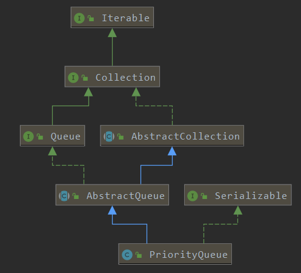
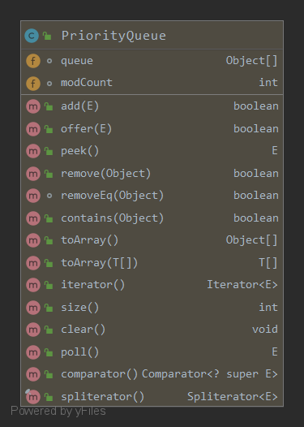

> 从PriorityQueue的`概念，结构，参数，源码解析（offer,poll,remove,add,grow），性能，线程安全性，使用场景，常见问题`8个方面进行分析。

>* An `unbounded priority queue` based on a `priority heap`. 
>* The elements of the priority queue are ordered according to their `natural ordering`, or by a `Comparator provided` at queue >construction time, depending on which constructor is used. 
>* A priority queue does `not permit null elements`. 
>* A priority queue relying on natural ordering also does `not permit insertion of non-comparable objects` (doing so may result in >ClassCastException).
>* The `head of this queue` is the `least element` with respect to the `specified ordering`. If multiple elements are tied for >least value, the head is one of those elements -- ties are broken arbitrarily. 
>* The queue retrieval operations `poll`, `remove`, `peek`, and element access the element at the head of the queue.
>* `A priority queue is unbounded`, but has an `internal capacity` governing the size of an `array` used to store the elements on >the queue. It is always at least as large as the queue size. As elements are added to a priority queue, its `capacity grows >automatically`. The details of the growth policy are not specified.
>* This class and its iterator implement all of the optional methods of the `Collection and Iterator interfaces`. 
>* The Iterator provided in method iterator() is `not guaranteed` to traverse the elements of the priority queue in any particular >`order`. If you need ordered traversal, consider using `Arrays.sort(pq.toArray())`.
>* Note that this implementation is `not synchronized`. Multiple threads should not access a PriorityQueue instance concurrently if >any of the threads modifies the queue. Instead, use the `thread-safe PriorityBlockingQueue` class.
>* Implementation note: this implementation provides 
>    * `O(log(n)) time` for the `enqueuing` and `dequeuing` methods (`offer, poll, remove() and add`); 
>    * `linear time` for the `remove(Object) and contains(Object)` methods; 
>    * `constant time` for the retrieval methods (`peek, element, and size`).
>This class is a member of the `Java Collections Framework`.

>关键点：基于priority heap，无界队列，实现Queue,Collection,Iterator接口、不允许null键/值、非线程安全、enqueue和dequeue都是O(long(n))，remove和contains是O(n)，peek是O(1)；

<!-- more --> 
# 概念
>* 优先队列跟普通的队列不一样，普通队列遵循FIFO规则出队入队，而优先队列每次都是优先级最高出队。
>* 优先队列内部维护着一个堆，每次取数据的时候都从堆顶取，这是优先队列的基本工作原理。
* jdk的优先队列使用PriorityQueue这个类，使用者可以自己定义优先级规则。

>PriorityQueue的类关系



>PriorityQueue的类成员



# 结构
一维数组

* Priority queue represented as a `balanced binary heap`:
* the two children of queue[n] are queue[2*n+1] and queue[2*(n+1)].  
* The priority queue is `ordered by comparator`, or by the elements' `natural ordering`, 
* if comparator is null: For each node n in the heap and each descendant d of n, n <= d.  
* The element with the `lowest value` is in queue[0], assuming the queue is nonempty.
```java
    // non-private to simplify nested class access
    transient Object[] queue; 
```

# 参数
* `initialCapacity`：初始化容量，默认为`11`；
* `comparator`:用于队列中元素排序；
* `size`:记录队列中元素个数；
* `modCount`:记录队列修改次数；
* `MAX_ARRAY_SIZE`: Integer.MAX_VALUE - 8;大概21亿
* 构造函数：新建1个空的队列；
```java
    public PriorityQueue(int initialCapacity, Comparator<? super E> comparator) {
        this.queue = new Object[initialCapacity];
        this.comparator = comparator;
    }
```
* 如果是由`SortedSet`,`PriorityQueue`这种有序的结构构建优先队列，直接`Arrays.copyOf`把数据复制到queue数组中；
* 如果是由无序数组构建优先队列，需要把数据复制到queue数组中后，执行`构建堆(heapify)`操作；

# 源码解析
## heapify-构建堆
```java
    /**
     * Establishes the heap invariant (described above) in the entire tree,
     * assuming nothing about the order of the elements prior to the call.
     */
    @SuppressWarnings("unchecked")
    private void heapify() {
        //从最后一个非叶子节点（父亲节点）开始遍历所有父节点，直到堆顶
        for (int i = (size >>> 1) - 1; i >= 0; i--){
            //下沉（将3 or 2者中较大元素下沉）
            siftDown(i, (E) queue[i]);
        }
    }
```

### siftDown-下沉
```java

    /**
     * Inserts item x at position k, maintaining heap invariant by demoting x down the tree repeatedly
     * until it is less than or equal to its children or is a leaf.
     *
     * @param k the position to fill
     * @param x the item to insert
     */
    private void siftDown(int k, E x) {
        if (comparator != null) {
            //按自定义顺序swap下沉
            siftDownUsingComparator(k, x);
        } else {
            //按字典顺序swap下沉
            siftDownComparable(k, x);
        }
    }
```

> 按字典顺序swap下沉
```java
    @SuppressWarnings("unchecked")
    private void siftDownComparable(int parent, E x) {
        Comparable<? super E> parentVal = (Comparable<? super E>) x;
        int half = size >>> 1;
        //二叉树结构，下标大于size/2都是叶子节点，其他的节点都有子节点。
        //循环直到k没有子节点：loop while a non-leaf
        while (parent < half) {
            //假设left节点为child中的最小值节点
            int left = (parent << 1) + 1;
            int right = left + 1;
            Object minVal = queue[left];
            //存在right，且right<left，则最小为right
            if (right < size && ((Comparable<? super E>) minVal).compareTo((E) queue[right]) > 0) {
                left = right;
                minVal = queue[right];
            }
            //如果parent节点<min(left,right),则不需要swap
            if (parentVal.compareTo((E) minVal) <= 0) {
                break;
            }
            //否则swap parent节点和min(left,right)的节点
            queue[parent] = minVal;
            //当前父节点取最小值的index继续loop
            parent = left;
        }
        //1.当前节点没有子节点，则k是叶子节点的下标，没有比它更小的了，直接赋值即可
        //2.当前节点下沉n轮后，将节点的值放到最终不需要再交换的位置（没有比它更小的或者到达叶子节点）
        queue[parent] = parentVal;
    }
```

> 按自定义顺序swap下沉，与siftDownComparable类似
```java
    @SuppressWarnings("unchecked")
    private void siftDownUsingComparator(int k, E x) {
        int half = size >>> 1;
        while (k < half) {
            int child = (k << 1) + 1;
            Object c = queue[child];
            int right = child + 1;
            if (right < size &&
                comparator.compare((E) c, (E) queue[right]) > 0)
                c = queue[child = right];
            if (comparator.compare(x, (E) c) <= 0)
                break;
            queue[k] = c;
            k = child;
        }
        queue[k] = x;
    }
```

## offer
```java
    /**
     * The number of times this priority queue has been structurally modified 
     */
    transient int modCount = 0; 
```
```java
    /** 
     * 节点插入到队列 
     */
    public boolean offer(E e) {
        if (e == null) {
            throw new NullPointerException();
        }
        //修改次数+1
        modCount++;
        int i = size;
        if (i >= queue.length) {
            //队列已满时，按50%动态扩容
            grow(i + 1);
        }
        size = i + 1;
        if (i == 0) {
            //队列为空时
            queue[0] = e;
        } else {
            //上浮调整堆顺序
            siftUp(i, e);
        }
        return true;
    }
```
>队列已满时，动态扩容：小于64时2倍(+2)扩容，大于64时0.5倍扩容；

> TODO 为什么要加2，why JDK不写注释...待搞清楚 
```java
    /**
     * Increases the capacity of the array.
     *
     * @param minCapacity the desired minimum capacity
     */
    private void grow(int minCapacity) {
        int oldCapacity = queue.length;
        // Double size if size<64; else grow by 50%
        int newCapacity = oldCapacity + (
            (oldCapacity < 64) ? (oldCapacity + 2) :(oldCapacity >> 1)
            );
        // overflow-conscious code 防越界
        if (newCapacity - MAX_ARRAY_SIZE > 0)
            newCapacity = hugeCapacity(minCapacity);
        //将queue中数据复制到扩容后的queue
        queue = Arrays.copyOf(queue, newCapacity);
    }
    
    private static int hugeCapacity(int minCapacity) {
        // overflow
        if (minCapacity < 0) {
            throw new OutOfMemoryError();
        }
        return (minCapacity > MAX_ARRAY_SIZE) ?
                Integer.MAX_VALUE :
                MAX_ARRAY_SIZE;
    }
```

> 节点上浮调整
```java
    
    /**
     * Inserts item x at position k, 
     * maintaining heap invariant by promoting x up the tree until it is greater than or equal to its parent, or is the root. 
     * 为保持堆的性质，将插入元素x一路上浮，直到满足x节点值>=父节点值，或者到达根节点；
     * @param k the position to fill 插入位置
     * @param x the item to insert 插入元素
     */
    private void siftUp(int k, E x) {
        if (comparator != null) {
            siftUpUsingComparator(k, x);
        } else {
            siftUpComparable(k, x);
        }
    }
```
    
> 按字典顺序swap上浮
```java
    @SuppressWarnings("unchecked")
    private void siftUpComparable(int k, E x) {
        Comparable<? super E> key = (Comparable<? super E>) x;
        //从当前节点循环上浮到堆顶节点
        while (k > 0) {
            //k节点的父节点索引
            int parent = (k - 1) >>> 1;
            //k节点的父节点值
            Object e = queue[parent];
            //比较k节点与父节点的值大小，父节点值较小时，终止遍历
            if (key.compareTo((E) e) >= 0) {
                break;
            }
            //父节点值较大时，交换k节点与父节点值
            queue[k] = e;
            //当前节点移到父节点，继续向上遍历
            k = parent;
        }
        //将当前节点值赋给交换后的父节点
        queue[k] = key;
    }
```
> 按自定义顺序swap上浮，与siftUpComparable类似
```java
    @SuppressWarnings("unchecked")
    private void siftUpUsingComparator(int k, E x) {
        while (k > 0) {
            int parent = (k - 1) >>> 1;
            Object e = queue[parent];
            if (comparator.compare(x, (E) e) >= 0)
                break;
            queue[k] = e;
            k = parent;
        }
        queue[k] = x;
    }

```
## add 
```java
    public boolean add(E e) {
        return offer(e);
    }
```
## remove
```java

    /**
     * Removes the ith element from queue.
     * <p>
     * Normally this method leaves the elements at up to i-1,
     * inclusive, untouched.  Under these circumstances, it returns null.
     * Occasionally, in order to maintain the heap invariant,
     * it must swap a later element of the list with one earlier thani.
     * Under these circumstances,
     * this method returns the element that was previously at the end of the list and is now at some position before i.
     * This fact is used by iterator.remove so as to avoid missing traversing elements.
     */
    @SuppressWarnings("unchecked")
    private E removeAt(int i) {
        assert i >= 0 && i < size;
        // 修改次数+1
        modCount++;
        // 堆尾元素Index
        int s = --size;
        if (s == i) {
            //如果删除的是堆尾元素，不需要进行siftUp
            queue[i] = null;
        } else {
            //拿出堆尾元素
            E moved = (E) queue[s];
            queue[s] = null;
            //将堆尾元素放到要删除的元素的位置，并执行siftDown
            siftDown(i, moved);
            //siftDown后，若元素没有改变，可能是因为要删除的结点和堆尾结点是跨子树，或者要删除的结点是叶子结点
            if (queue[i] == moved) {
                //如果删除的元素和堆尾元素不在一个子树，需要siftUp操作
                siftUp(i, moved);
                if (queue[i] != moved) {
                    return moved;
                }
            }
        }
        return null;
    }
```
>注意
* 普通元素删除，将堆尾元素和要删除的位置替换，然后`siftDown`就可以；
* 但当删除的元素和堆尾元素之间如果是`跨子树`的话，需要从删除位置执行`siftUp`操作；
>示例
```
      0
  4       1
5   6   2   3
```
删除5，siftdown后
```
      0
  4       1
3   6   2   
```
此时还需要siftup一次，才能满足二叉堆的结构
```
      0
  3       1
4   6   2   
```


## poll
```java
    public E poll() {
        if (size == 0)
            return null;
        //queue修改次数+1
        modCount++;
        //堆顶元素
        E result = (E) queue[0];

        //堆尾索引
        int s = --size;
        //堆尾元素
        E x = (E) queue[s];
        //置空堆尾元素
        queue[s] = null;
        if (s != 0) {
            //堆尾元素拿出作为堆顶值后，从堆顶执行下沉
            siftDown(0, x);
        }
        //返回堆顶元素
        return result;
    }
```
## peek
```java
    public E peek() {
        //返回堆顶元素
        return (size == 0) ? null : (E) queue[0];
    }
```

# 性能
参考二叉堆性能
* `O(log(n)) time` for the `enqueuing` and `dequeuing` methods (`offer, poll, remove() and add`);
* `linear time` for the `remove(Object) and contains(Object)` methods;
* `constant time` for the retrieval methods (`peek, element, and size`).
# 线程安全性
并发修改队列时非线程安全，线程安全版本使用`PriorityBlockingQueue`
# 使用场景
## PriorityQueue处理优先级场景
如医院急诊科接诊要按病痛的优先级处理；构建好优先队列后逐个poll即可；
## PriorityQueue求TopK大/小的元素
使用`小顶堆`来实现TopK问题求解：维护一个大小为K的最大堆，那么在堆中的数都是TopK。
* 处理过程：在添加一个元素之后，如果小顶堆的大小大于 K，那么需要将小顶堆的堆顶元素去除
* 时间复杂度：O(Nlog(K)) 
* 空间复杂度： O(K)
* 特别适合处理`海量数据`

在海量数据场景下，单机通常不能存放下所有数据。
* 拆分：可以按照`哈希取模`方式拆分到多台机器上；在每个机器上维护`最大堆`；
* 整合：将每台机器得到的最大堆`合并`成最终的最大堆。

```java
    @Test
    public void test_topK() {
        int k = 4;
        List<Integer> array = Arrays.asList(11, 0, 9, 8, 6, 1, 4, 5, 3, 2, 7);

        PriorityQueue topKQueue = new PriorityQueue();
        for (int i = 0; i < array.size(); i++) {
            int o = array.get(i);
            if (topKQueue.size() < k) {
                //一直加到K
                topKQueue.add(o);
            } else {
                Object min = topKQueue.peek();
                if (o > (int) min) {
                    //最小堆大小超过K且当前元素比堆顶大时，移除堆顶元素，并加入新元素
                    topKQueue.poll();
                    topKQueue.add(o);
                }
            }
        }
    }
```
>注意：可以skip比堆顶还小的元素

>求 Top k，更简单的方法可以直接用内置的`TreeMap`或者`TreeSet`，
>TODO：TreeMap和TreeSet源码解析

>Scanning through a large collection of statistics to report the top N items 
>eg.N busiest network connections, N most valuable customers, N largest disk users...
## PriorityQueue在Hadoop中的应用
在 hadoop 中，排序是 MapReduce 的灵魂，MapTask 和 ReduceTask 均会对数据按 Key 排序，这个操作是 MR 框架的默认行为，不管你的业务逻辑上是否需要这一操作。
* MapReduce 框架中，用到的排序主要有两种：`快速排序`和`基于堆实现的优先队列`。
* Mapper 阶段： 从 map 输出到环形缓冲区的数据会被排序（这是 MR 框架中改良的快速排序），这个排序涉及`partition`和`key`，
当缓冲区容量占用 80%，会`spill`数据到磁盘，生成`IFile`文件，
`Map`结束后，会将`IFile`文件排序`合并`成一个大文件（基于堆实现的优先级队列），以供不同的`reduce`来拉取相应的数据。
* Reducer 阶段： 
从 Mapper 端取回的数据已是部分有序，Reduce Task 只需进行一次`归并排序`即可保证数据整体有序。
为了提高效率，Hadoop 将`sort`阶段和`reduce`阶段`并行化`，
在`sort`阶段，Reduce Task 为内存和磁盘中的文件建立了`小顶堆`，保存了指向该小顶堆根节点的迭代器，并不断的移动迭代器，
以将 key 相同的数据`顺次`交给`reduce()`函数处理，期间移动迭代器的过程实际上就是不断调整小顶堆的过程（建堆→取堆顶元素→重新建堆→取堆顶元素...），这样，sort 和 reduce 可以并行进行。

# 常见问题
1. PriorityQueue的底层数组叫什么？原理是什么？如何实现排序的？
2. 如何在N（N>>10000）个数据中找到最大的K个数？要求复杂度小于O(N*N)！

# 参考
* [jdk8.PriorityQueue](https://docs.oracle.com/javase/8/docs/api/java/util/PriorityQueue.html) 
* [堆排序](https://juejin.im/post/5cba5cb9518825327e23f078)
* [java集合之PriorityQueue源码分析](https://juejin.im/post/5cba5cb9518825327e23f078)
* [priorityQueue元素删除问题](https://stackoverflow.com/questions/38696556/in-java-priority-queue-implementation-remove-at-method-why-it-does-a-sift-up-af)
