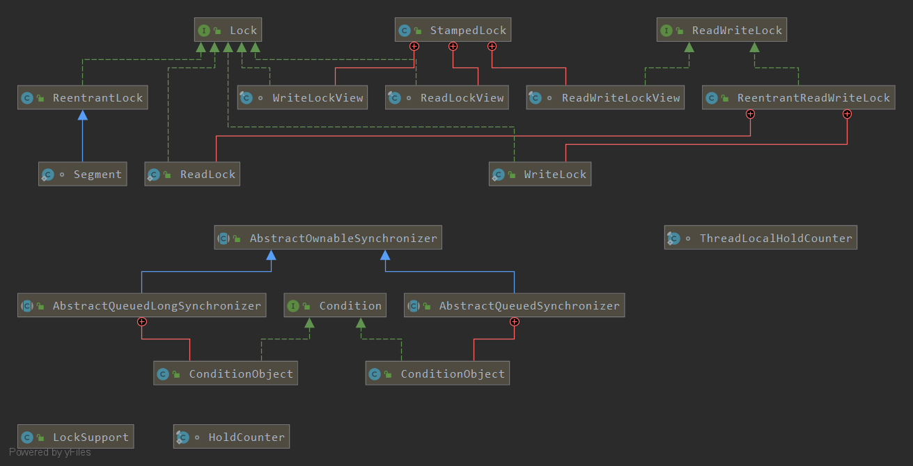
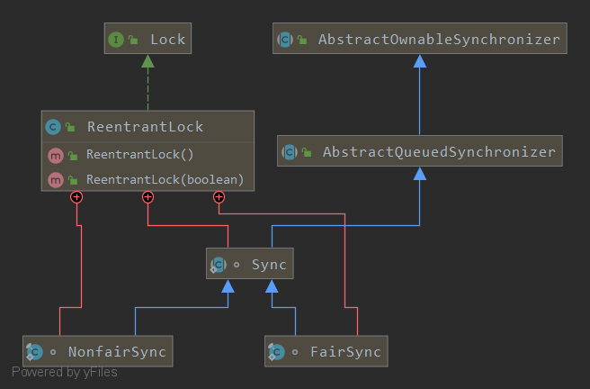

# 关于锁
>在计算机科学中，锁是在执行`多线程`时用于强行`限制资源访问`的`同步机制`，即用于在`并发控制`中保证对`互斥`要求的满足。

## 锁包含的功能
* 可中断
* 可设置过期时间
* 可设置为是否公平

# juc中的锁
>juc中的锁的类图

# synchronized 关键词

# Lock
## ReentrantLock
>类图

## ReadWriteLock

## Condition

# 参考
* [jdk8.PriorityBlockingQueue](https://docs.oracle.com/javase/8/docs/api/java/util/concurrent/PriorityBlockingQueue.html) 
