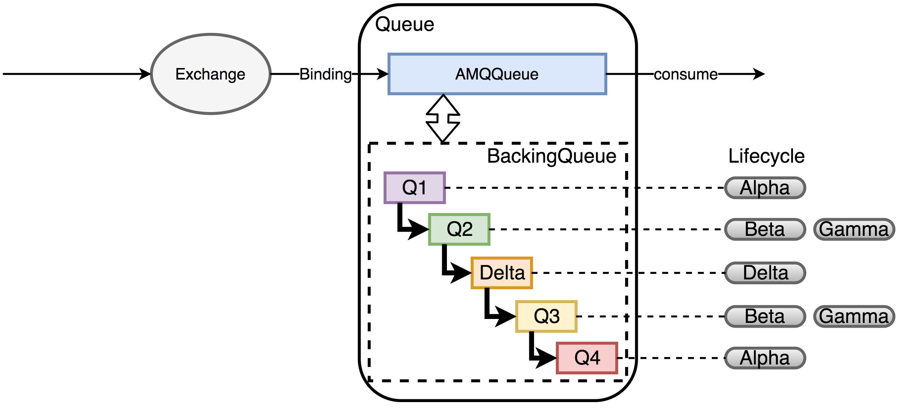
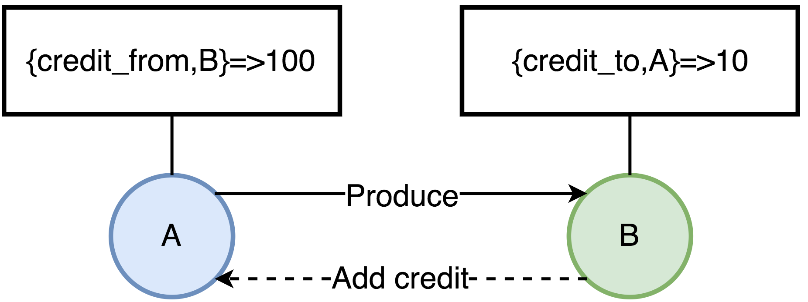

RabbitMQ`如何存储`消息，RabbitMQ如何`接收消息`和`投递消息`？

<!-- more --> 

# RabbitMQ的内部结构
## RabbitMQ的进程结构

* `cp_acceptor`：负责接受客户端`连接`，然后为客户端连接创建rabbit_reader
、rabbit_writer、rabbit_channel进程
* `rabbit_reader`：负责解析客户端AMQP帧，然后将请求发送给rabbit_channel进程
* `rabbit_writer`：负责向客户端`返回`数据
* `rabbit_channel`：负责解析AMQP方法，以及对消息进行`路由`，然后发送给对应的队列进程。
* `rabbit_amqqueue_process`：rabbit队列进程，该进程一般在rabbitmq创建队列时被创建，其主要负责消息的`接收`/`投递`逻辑
* `rabbit_msg_store`：存储服务器进程，主要负责消息的`持久化存储`

>* tcp_acceptor和rabbit_msg_store只会有一个;
>* rabbit_amqqueue_process进程的数量则和队列数量保持一致;
>* 每个客户端连接对应一个rabbit_reader和rabbit_writer进程;
>* 每一个连接的通道对应一个rabbit_channel进程。

>通常来说，客户端发起一条连接的同时，可以打开多条channel，相对连接的open/close来说，对channel进行open和close的操作开销会更小。

>最佳实践是一个生产者/消费者进程对应一个connection，具体发送一个线程对应一个channel即可。

## RabbitMQ中队列的内部结构

* `AMQPQueue`：负责AMQP协议相关的消息处理，包括接收消息，投递消息，Confirm消息等；
* `BackingQueue`：提供AMQQueue调用的接口，完成消息的存储和持久化工作

## RabbitMQ中队列的存储状态
BackingQueue由Q1,Q2,Delta,Q3,Q4五个子队列构成，在BackingQueue中，消息的生命周期有4个状态：
| queue | state\store | message itself | message index(message position) |
| ----- | ----------- | -------------- | ------------------------------- |
| q1,q4 | alpha       | RAM            | RAM                             |
| q2,q3 | beta        | DISK           | RAM                             |
| q2,q3 | gamma       | DISK           | RAM&DISK                        |
| delta | delta       | DISK           | DISK                            |

* `alpha`: 消息的内容和消息索引都在RAM中。（Q1，Q4）
* `beta`: 消息的内容保存在Disk上，消息索引保存在RAM中。（Q2，Q3）
* `gamma`: 消息的内容保存在Disk上，消息索引在DISK和RAM上都有。（Q2，Q3）
* `delta`: 消息内容和索引都在Disk上。(Delta）

这里以持久化消息为例（可以看到非持久化消息的生命周期会简单很多），从Q1到Q4，消息实际经历了一个`RAM->DISK->RAM`这样的过程，
BackingQueue这么设计的目的有点类似于Linux的虚拟内存`Swap`区，
* 当队列`负载很高`时，通过将部分消息放到磁盘上来节省内存空间，
* 当`负载降低`时，消息又从磁盘回到内存中，让整个队列有很好的弹性。
因此触发消息流动的主要因素是：
1. `消息被消费`；
2. `内存不足`。

* RabbitMQ会更具`消息的传输速度`来计算当前`内存中允许保存的最大消息数量`（Traget_RAM_Count），
* 当`内存中保存的消息数量 + 等待ACK的消息数量 > Target_RAM_Count`时，RabbitMQ才会把消息`写到磁盘`上，
* 所以说虽然理论上消息会按照`Q1->Q2->Delta->Q3->Q4`的顺序流动，但是并不是每条消息都会经历所有的子队列以及对应的生命周期。
* 从RabbitMQ的Backing Queue结构来看，当内部不足时，消息要经历多个生命周期，在Disk和RAM之间置换，这实际会`降低RabbitMQ的处理性能`（后续的流控就是关联的解决方法）。

>for `persistent` messages, the `message` and its `position` within the queue are always held `on disk`.
> the term `gamma` seldom appears. 

## RabbitMQ的流控-信用机制(Credit)
当RabbitMQ出现内存(默认是0.4)或者磁盘资源达到阈值时，会触发流控机制：`阻塞Producer的Connection`，让生产者不能继续发送消息，直到内存或者磁盘资源得到释放。
RabbitMQ基于Erlang/OTP开发，一个消息的生命周期中，会涉及多个进程间的转发，这些Erlang`进程之间不共享内存`，每个进程都有自己独立的内存空间，如果没有合适的流控机制，可能会导致某个进程占用内存过大，`导致OOM`。
因此，要保证各个进程占用的内容在一个合理的范围，RabbitMQ的流控采用了一种`信用机制(Credit)`，为每个进程维护了4类键值对：
* `{credit_from,From}`-该值表示还能向消息接收进程From`发送`多少条消息;
* `{credit_to,To}`-表示当前进程再`接收`多少条消息，就要向消息`发送`进程增加Credit数量;
* `credit_blocked`-表示当前进程被哪些进程block了，比如进程A向B发送消息，那么当A的进程字典中{credit_from,B}的值为0是，那么A的credit_blocked值为[B];
* `credit_deferred`-`消息接收`进程向`消息发送`进程增加Credit的`消息列表`，当进程被Block时会记录消息信息，`Unblock后依次发送这些消息`;


如图所示:
* A进程当前可以发送给B的消息有100条，每发一次，值减1，直到为0，A才会被Block住。
* B消费消息后，会给A增加新的Credit，这样A才可以持续的发送消息。

这里只画了两个进程，多进程串联的情况下，这中影响也就是从底向上传递的。

## RabbitMQ的消息类型
Messages, and their position in the queue, can be `in memory` or `on disk`, or both. 
* `Persistent messages` will have both message and position pushed to disk as soon as they arrive; 
* `transient messages` can be written to disk (and thus both types can be evicted from memory) under memory pressure. 

The question of whether a message is in `RAM` and whether it is `persistent` are orthogonal（正交，即可同时存在）.
Messages are persisted using the `queue index`（队列索引） and the `message store`（消息数据）. 
* `queue index` holds the `position` of the message **within this queue** along with a couple of small bits of `metadata`
* `message store` holds the message itself (including headers and other properties).
* `small messages` can be embedded directly in the queue index and bypass the message store altogether.

## RabbitMQ的消息状态
每个消息存储在RabbitMQ中都有自己的状态：Ready，Unacked,Ack
* Ready：等待消费状态。
* Unacked:等待被确认状态，当前消息已经被发送到了客户端。当客户端端断开后，如果这条消息没有被确认，这条消息重新进入Ready中。
* Ack：已被确认状态

# RabbitMQ的消息存储
RabbitMQ的消息持久化实际包括两部分：
* 队列索引(rabbit_queue_index)：负责维护队列中落盘消息的信息，包括消息的存储地点、是否已经被交付给消费者、是否已被消费者ack等，每个队列都有一个与之对应的rabbit_queue_index。
* 消息存储(rabbit_msg_store)：rabbit_msg_store以键值对的形式存储消息，每个节点有且只有一个，所有队列共享。rabbit_msg_store又可以分为`msg_store_persistent`和`msg_store_transient`，
    * msg_store_persistent负责持久化消息的存储，不会丢失，
    * msg_store_transient负责非持久化消息的存储，重启后消息会丢失。

>通过配置环境变量`RABBITMQ_MNESIA_BASE`可以指定存储目录，一般配置RABBITMQ_MNESIA_BASE=/srv/rabbitmq。

```bash 
$ ls -hl  /var/lib/rabbitmq/mnesia/rabbit65 | grep msg_store
drwxr-xr-x.  2 rabbitmq rabbitmq   21 Sep  9 21:26 msg_store_persistent
drwxr-xr-x   2 rabbitmq rabbitmq   19 Jul 19 21:25 msg_store_transient
```
其中`msg_store_transient`、queues和`msg_store_persistent`就是实际消息的存储目录。

## rabbit_msg_store存储
RabbitMQ通过配置queue_index_embed_msgs_below可以指定根据消息存储位置，默认queue_index_embed_msgs_below是`4096`字节(包含消息体、属性及headers)，小于该值的消息存在`rabbit_queue_index`中。

```bash
sudo ls -hl  /var/lib/rabbitmq/mnesia/rabbit65/msg_store_persistent
-rw-r--r-- 1 rabbitmq rabbitmq 2.5M Sep 10 19:16 356.rdq

sudo ls -hl  /var/lib/rabbitmq/mnesia/rabbit65/msg_store_transient
-rw-r--r-- 1 rabbitmq rabbitmq 0 Jul 19 21:25 0.rdq
```

经过rabbit_msg_store处理的消息都会以`追加`的方式写入到文件中，文件名从0开始累加，后缀是`.rdq`，当一个文件的大小超过指定的限制(`file_size_limit`)后，关闭这个文件再创建一个新的文件存储。 

>rdq文件消息格式  
 `<<Size:64, MsgId:16/binary, MsgBody>>`
* MsgId为RabbitMQ通过rabbit_guid:gen()每一个消息生成的GUID，
* MsgBody会包含消息对应的`exchange`，`routing_keys`，`消息的内容`，消息对应的`协议版本`，消息`内容格式`。

* 消息存储时，RabbitMQ会在`ETS(Erlang Term Storge)`表中记录消息在文件中的`位置映射`和文件的相关信息。
* 消息读取时，先根据消息的`msg_id`找到对应的文件，如果文件存在且未被锁住则直接打开文件，如果文件不存在或者锁住了则发请求到`rabbit_msg_store`处理。

## 队列的索引文件
查看索引信息
```bash
 ls -hl  /var/lib/rabbitmq/mnesia/rabbit65/queues/9ETDQOQ2E4JS49H80ILRO1YHA
total 24K
-rw-r--r-- 1 rabbitmq rabbitmq 21K Aug 14 20:19 1.idx
-rw-r--r-- 1 rabbitmq rabbitmq   0 Aug 14 20:19 journal.jif
```
* rabbit_queue_index顺序存储段文件，文件编号从0开始，后缀.idx，
* 每个段文件包含固定的`SEGMENT_ENTRY_COUNT`条记录。
* SEGMENT_ENTRY_COUNT默认是`16384`，每个`rabbit_queue_index`从磁盘读取消息的时候至少读取一个段文件。

## 过期消息删除
消息的删除只是从`ETS(Erlang Term Storge)`表删除执行消息的相关信息，同时更新对应的存储文件的相关信息，并不立即对文件中的消息进程删除，后续会有专门的`垃圾回收进程`负责合并待回收消息文件。
>标记删除，类似habse/cassandra里面的`tombstone`

* 当所有文件中的垃圾消息（已经被删除的消息）比例大于阈值（`GARBAGE_FRACTION = 0.5`）时，会触发`文件合并`操作（至少有3个文件存在的情况下），以提高磁盘利用率。
>类似hbase中的`minor/major compaction`
* `publish`消息时写入内容，`ack`消息时删除内容（更新该文件的有用数据大小），当一个文件的有用数据等于0时，删除该文件。

# RabbitMQ的消息读写过程

* rabbit_channel进程确定了消息将要投递的目标队列，
* rabbit_amqqueue_process是队列进程，每个队列都有一个对应的进程，实际上rabbit_amqqueue_process进程只是提供了逻辑上对队列的相关操作，他的真正操作是通过调用指定的backing_queue模块提供的相关接口实现的，默认情况该backing_queue的实现模块为rabbit_variable_queue。
## 消息publish
rabbit_amqqueue_process对消息的主要处理逻辑位于`deliver_or_enqueue`函数，该方法将消息直接传递给消费者，或者将消息存储到队列当中。

整体处理逻辑如下：
1. 首先处理消息的`mandory标志`，和`confirm属性`。
    * mandatory标志告诉服务器至少将该消息route到一个队列中，否则将消息返还给生产者。
    * confirm则是消息的发布确认。
2. 然后判断队列中是否有消费者正在等待，如果有则直接调用`backing_queue`的接口给客户端发送消息。
3. 如果队列上没有消费者，根据当前相关设置判断消息是否需要`丢弃`，不需要丢弃的情况下调用backing_queue的接口将消息入队。


* 如果调用到该方法的BQ:publish则说明当前队列没有消费者正在等待，消息将进入到队列。backing_queue实现了消息的存储，他会尽力将durable=true的消息做持久化存储。
* 初始默认情况下，非持久化消息直接进入内存队列，此时效率最高，当内存占用逐渐达到一个阈值时，消息和消息索引逐渐往磁盘中移动，随着消费者的不断消费，内存占用的减少，消息逐渐又从磁盘中被转到内存队列中。
* 消息在这些Queue中传递的"一般"过程`q1->q2->delta->q3->q4`，一般负载较轻的情况消息不需要走完每个Queue，大部分都可以跳过。
* 每次入队消息后，判断RabbitMQ系统中使用的内存是否过多，此操作是尝试将内存中的队列数据写入到磁盘中.
* 内存中的消息数量（RamMsgCount）及内存中的等待ack的消息数量（RamAckIndex）的和大于允许的内存消息数量（TargetRamCount）时，多余数量的消息内容会被写到磁盘中.

## 消息consuming

>获取消息
* 尝试从q4队列中获取一个消息，如果成功，则返回获取到的消息，如果失败，则尝试通过试用fetch_from_q3/1从q3队列获取消息，成功则返回，如果为空则返回空；
* 注意fetch_from_q3从Q3获取消息，如果Q3为空，则说明整个队列都是空的，无消息，消费者等待即可。

>取出消息后
* 如果Q4不为空，取出消息后直接返回；
* 如果Q4为空，Q3不为空，从Q3取出消息后，判断Q3是否为空，如果Q3为空，Delta不为空，则将Delta中的消息转移到Q3中，下次直接从Q3消费；
* 如果Q3和Delta都是空的，则可以任务Delta和Q2的消息都是空的，此时将Q1的消息转移到Q4，下次直接从Q4消费即可。

# 参考
* [RabbitMQ存储机制源码分析](https://sq.163yun.com/blog/article/163362787003510784)
* [a-walkthrough-of-the-design-and-architecture-of-rabbitmq](https://www.slideshare.net/RabbitMQ-summit/a-walkthrough-of-the-design-and-architecture-of-rabbitmq-ayanda-dube-125711827)