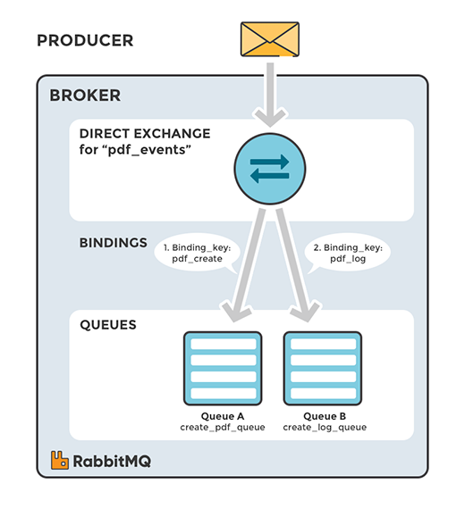
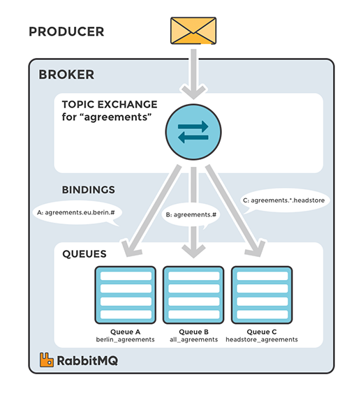
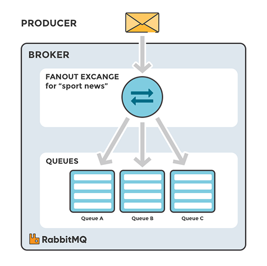

rabbitmq系统架构和常规使用模式

<!-- more --> 
# 物理架构

>First node is the master of cluster – two other nodes will join him. We use container management to enable an UI administration console for each node. 
>Every node has default connection and UI management ports exposed. 
>Important thing is to link rabbit2 and rabbit3 constainers to rabbit1, which is necessary while joining to cluster mastering by rabbit1.
```bash
rabbit1 --name rabbit1 -e RABBITMQ_ERLANG_COOKIE='rabbitcluster' -p 30000:5672 -p 30001:15672 rabbitmq:management

rabbit2 --name rabbit2 --link rabbit1:rabbit1 -e RABBITMQ_ERLANG_COOKIE='rabbitcluster' -p 30002:5672 -p 30003:15672 rabbitmq:management

rabbit3 --name rabbit3 --link rabbit1:rabbit1 -e RABBITMQ_ERLANG_COOKIE='rabbitcluster' -p 30004:5672 -p 30005:15672 rabbitmq:management
```


>We use Vault as a credentials manager when applications try to authenticate against RabbitMQ node or user tries to login to RabbitMQ web admin console. 
>Each RabbitMQ node registers itself after startup in Consul and retrieves list of nodes running inside a cluster. 
>Vault is integrated with RabbitMQ using dedicated secrets engine. 

# 逻辑架构

* 发布者（producer）是发布消息的应用程序。
* 队列（queue）用于消息存储的缓冲。
* 消费者（consumer）是接收消息的应用程序。
* 消息代理（message broker）：消息代理（message brokers）从生产者（producers）那儿接收消息，并根据既定的路由规则把接收到的消息发送给处理消息的消费者（consumers）。

>由于AMQP是一个网络协议，所以这个过程中的发布者，消费者，消息代理可以存在于不同的设备上。

>`AMQP`，即`Advanced Message Queuing Protocol`,一个提供统一消息服务的应用层标准高级消息队列协议,是应用层协议的一个开放标准,为面向消息的中间件设计。

>基于此协议的`客户端`与`消息中间件`可传递消息，并不受客户端/中间件不同产品，不同的开发语言等条件的限制。Erla

## RabbitMQ消息模型的核心理念
* 发布者（producer）不会直接发送任何消息给队列。
* 事实上，发布者（producer）甚至不知道消息是否已经被投递到队列。
* 发布者（producer）只需要把消息发送给一个交换机（exchange）。
* 交换机非常简单，它一边从发布者方接收消息，一边把消息推送到队列。交换机必须知道如何处理它接收到的消息，是应该推送到指定的队列还是是多个队列，或者是直接忽略消息。

这些规则是通过交换机类型（exchange type）来定义的。


# 交换机（Exchange）
## 交换机的属性
除交换机类型外，在声明交换机时还可以附带许多其他的属性，其中最重要的几个分别是：
* Name
* Durability （消息代理重启后，交换机是否还存在）
* Auto-delete （当所有与之绑定的消息队列都完成了对此交换机的使用后，删掉它）
* Arguments（依赖代理本身）

交换机可以有两个状态：`持久（durable）`、`暂存（transient）`。持久化的交换机会在消息代理（broker）重启后依旧存在，而暂存的交换机则不会（它们需要在代理再次上线后重新被声明）。然而并不是所有的应用场景都需要持久化的交换机。

## 交换机的类型
### 直连交换机（`amq.direct`）：
定义：将消息中的Routing key与该Exchange关联的所有Binding中的Routing key进行比较，如果相等，则发送到该Binding对应的Queue中。



### 主题交换机（`amq.topic`）
定义：将消息中的Routing key与该Exchange关联的所有Binding中的Routing key进行规则对比，如果匹配上了，则发送到该Binding对应的Queue中。

主题交换机是很强大的，它可以表现出跟其他交换机类似的行为当一个队列的绑定键为 "#"（井号） 的时候，这个队列将会无视消息的路由键，接收所有的消息。当 * (星号) 和 # (井号) 这两个特殊字符都未在绑定键中出现的时候，此时主题交换机就拥有的直连交换机的行为。



    > 示例中，我们发送的所有消息都是用来描述小动物的。发送的消息所携带的路由键是由三个单词所组成的，这三个单词被两个.分割开。
    路由键里的第一个单词描述的是动物的手脚的利索程度，第二个单词是动物的颜色，第三个是动物的种类。所以它看起来是这样的： `<celerity>.<colour>.<species>`。
    我们创建了三个绑定：Q1的绑定键为 `*.orange.*`，Q2的绑定键为 `*.*.rabbit` 和` lazy.#` 。
    这三个绑定键被可以总结为：
    >* Q1 对所有的桔黄色动物都感兴趣。
    >* Q2 则是对所有的兔子和所有懒惰的动物感兴趣。
### 扇型交换机（`amq.fanout`）
定义：直接将消息转发到所有binding的对应queue中，这种exchange在路由转发的时候，忽略Routing key。



>把消息发送给所有绑定的队列，没有足够的灵活性，它能做的仅仅是广播。
### 头交换机（`amq.headers`）
定义：将消息中的`headers`与该Exchange相关联的所有Binging中的参数进行匹配，如果匹配上了，则发送到该Binding对应的Queue中。

>header exchange(头交换机)和主题交换机有点相似，但是不同于主题交换机的路由是基于路由键，
头交换机的路由值基于消息的header数据。 主题交换机路由键只能是字符串,而头交换机可以是`整型`和`哈希值` 

### 默认交换机
```python
channel.basic_publish(exchange='',
                      routing_key='hello',
                      body=message)
```

默认交换机（default exchange）实际上是一个由消息代理预先声明好的没有名字（名字为空字符串）的直连交换机（direct exchange）。它有一个特殊的属性使得它对于简单应用特别有用处：那就是每个新建队列（queue）都会自动绑定到默认交换机上，绑定的路由键（routing key）名称与队列名称相同。
>The default exchange is a direct exchange with no name (empty string) pre-declared by the broker. It has one special property that makes it very useful for simple applications: 
>every queue that is created is automatically bound to it with a routing key which is the same as the queue name.

## 路由(Routing)
* 功能：用于订阅消息的一个字集
* 应用场景：日志消息系统中，我们只需要把严重的错误日志信息写入日志文件（存储到磁盘），但同时仍然把所有的日志信息输出到控制台中；发送消息到一个exchange(direct类型)，把日志级别作为RoutingKey。这样接收日志的脚本(consumer)就可以根据logLevel来选择它想要处理的日志。


* 注意：绑定RoutingKey的意义取决于交换机（exchange）的类型。扇型交换机（fanout exchanges）会忽略这个值。

# 队列
AMQP中的队列（queue）跟其他消息队列或任务队列中的队列是很相似的：它们存储着即将被应用消费掉的消息。  
队列跟交换机共享某些属性，但是队列也有一些另外的属性。
* NameDurable（消息代理重启后，队列依旧存在）
* Exclusive（只被一个连接（connection）使用，而且当连接关闭后队列即被删除）
* Auto-delete（当最后一个消费者退订后即被删除）
* Arguments（一些消息代理用他来完成类似与TTL的某些额外功能）队列在声明（declare）后才能被使用。

队列声明
* 如果一个队列尚不存在，声明一个队列会创建它。
* 如果声明的队列已经存在，并且属性完全相同，那么此次声明不会对原有队列产生任何影响。
* 如果声明中的属性与已存在队列的属性有差异，那么一个错误代码为406的通道级异常就会被抛出。

## RabbitMQ实现的RPC


RPC工作流程:
1. 当客户端启动的时候，它创建一个匿名独享的回调队列。
2. 在RPC请求中，客户端发送带有两个属性的消息：一个是设置回调队列的;reply_to属性，另一个是设置唯一值的correlation_id属性。
3. 将请求发送到一个rpc_queue队列中。
4. RPCServer等待请求发送到这个队列中来。当请求出现的时候，它执行他的工作并且将带有执行结果的消息发送给reply_to字段指定的队列。
5. 客户端等待回调队列里的数据。当有消息出现的时候，它会检查correlation_id属性。如果此属性的值与请求匹配，将它返回给应用。

# 使用问题记录
## basicQos控制消费者接收的消息数量
```java
Channel channel = ...;
Consumer consumer = ...;
channel.basicQos(10); // Per consumer limit
channel.basicConsume("my-queue", false, consumer);
```

# 参考 
* [Using RabbitMQ in Cluster](https://dzone.com/articles/rabbitmq-in-cluster)
* [RabbitMQ Cluster with Consul and Vault](https://piotrminkowski.wordpress.com/2018/12/27/rabbitmq-cluster-with-consul-and-vault/)
* [RabbitMQ博客列表](https://www.jianshu.com/p/cd81afa8ade1)

