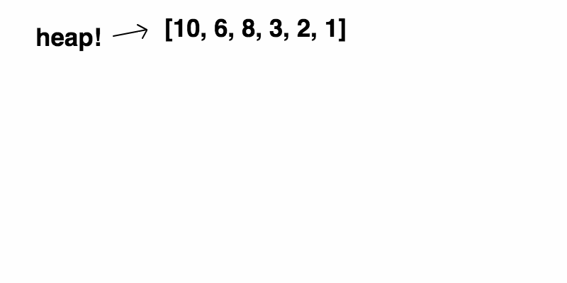
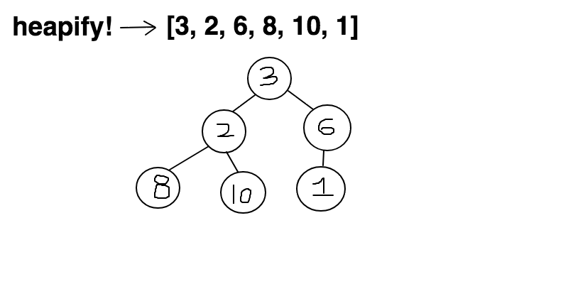
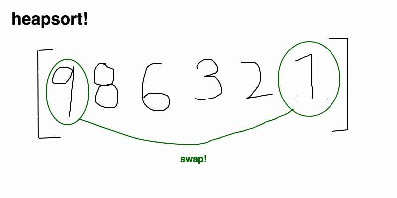

 
关键点：二叉堆基于`一维数组`构建完全二叉树结构，其inser和pop复杂度为log(n),pop的复杂度为O(1)，适用于优先队列场景；

<!-- more --> 
 
 # 数据结构中的堆栈
 ##  Stack栈
>栈就像装数据的桶或箱子
* 栈它是一种具有后进先出(LIFO)性质的数据结构，也就是说后存放的先取，先存放的后取。
* 如同我们要取出放在箱子里面底下的东西（放入的比较早的物体），我们首先要移开压在它上面的物体（放入的比较晚的物体）。

 ## Heap堆
>堆像一棵倒过来的树
* 堆是一种经过排序的树形数据结构，每个结点都有一个值。通常我们所说的堆的数据结构，是指二叉堆。
* 堆的特点是根结点的值最小（或最大），且根结点的两个子树也是一个堆。
* 由于堆的这个特性，常用来实现优先队列;
* 堆的存取是随意，这就如同我们在图书馆的书架上取书，虽然书的摆放是有顺序的，但是我们想取任意一本时不必像栈一样，先取出前面所有的书，书架这种机制不同于箱子，我们可以直接取出我们想要的书。

 # 内存分配中的堆栈
* 内存中的`Stack区`中分配局部变量空间，
* 内存中的`Heap区`是用于分配程序员申请的内存空间。
* 另外还有`静态区`是分配静态变量/全局变量空间的；`只读区`是分配常量和程序代码空间的；以及其他一些分区。

>* 数据结构中的堆栈，是一种`逻辑结构`，是一种`抽象`的概念，如线性表；
>* 内存分配中的堆栈，是一种`存储结构`，是一种`具体/物理`的概念，是一块具体的内存空间；

>下文中的堆是指数据结构中的Heap

# 堆（Heap）
堆是计算机科学中的一种特别的树状数据结构。
若是满足以下特性，即可称为堆：
* 给定堆中任意节点 P和C，
* 若P是C的母节点，那么P的值会小于等于（或大于等于）C的值。
* 若母节点的值恒小于等于子节点的值，此堆积称为最小堆（min heap）；
* 反之，若母节点的值恒大于等于子节点的值，此堆积称为最大堆（max heap）。
* 在堆中最顶端的那一个节点，称作根节点（root node），根节点本身没有母节点（parent node）。

堆始于`JWJ Williams`在1964年发表的`堆排序`（`heap sort`），当时他提出了二元堆积树作为此演算法的资料结构。堆在`Dijkstra`算法中亦为重要的关键。

## 堆的应用
在`队列`中，调度程序反复`提取队列中第一个作业并运行`，实际会有这样的情况
* 某些`耗时较短`的任务`等待很长时间`才被处理，
* 某些`耗时不短`，但`重要性`较高的任务，应当具有`优先权`：优先队列  

堆即为解决此类问题设计的一种数据结构。

 # 二叉堆(binary heap)
二叉堆是一种特殊的堆，
* 二叉堆具有`堆`的性质：父节点的键值总是大于或等于（小于或等于）任何一个子节点的键值；
* 二叉堆又具有`二叉树`的性质：二叉堆是`完全二叉树`或者是近似完全二叉树）；
* 当父节点的键值大于或等于它的每一个子节点的键值时我们称它为最大堆；
* 当父节点的键值小于或等于它的每一个子节点的键值时我们称它为最小堆；



## 二叉堆的性能
* pop和insert：`O(log(n))`
* peak：`O(1)`


## 二叉堆的节点类型
设堆大小为N，则以下节点的数组Index为：
* 父节点：P
* 左孩子：L=2P+1
* 右孩子：R=2P+2
* 最后一个父节点：(N/2)-1

## 二叉堆的操作类型
* pop：提取堆顶元素
* insert：插入节点
* peak：查询堆顶

## 构建二叉堆（heapify）
* 将一个未排序的数组构建成二叉堆（升序/降序）；
* 将数组假定为一个二叉堆，然后`从最后一个父节点`开始`向上遍历`，对每个父节点执行`下沉`操作，直到根节点；
>`Heapify`后只能保证趋势顺序，`HeapSort`保证绝对顺序  
> 浮浮沉沉



 ## 插入节点(insert)
* 在`堆尾`新增元素,数组大小不足时需要扩容；
* 从最后一个父节点开始执行`上浮`；
* 直到父节点的值小于或等于该节点，才停止上浮，即插入结束。

>浮浮沉沉

## 提取最大/小节点(pop)
删除后需要要保持堆的完全二叉树特性；
* 将`堆尾`元素替换到`堆顶`位置；
* 抽取`堆顶`元素；
* 以新的`堆顶`元素作为父节点，执行`下沉`；
* 直到子节点小于或等于改节点，才通知下沉；
* 返回抽取的堆顶元素，即pop结束;
 
>浮沉沉沉

# 堆排序
可以利于堆的特性(顶总是最值)来处理排序问题；重复从堆顶获取最值来完成数组排序；
1. 对未排序的数组执行heapify，构建一个最大堆;
2. 重复pop堆顶元素操作（下沉调整），直到堆元素为1；
3. pop出的元素组成的数组即为排序后结果;



>时间复杂度：O(n) + O(n*log(n)) = O(n*log(n))

# 二叉堆的Java实现
```java 
/**
 * 二叉堆
 * 示例日志：https://gist.github.com/geosmart/c31fe452f0b536ea12fbda72c1385553
 * 完整源码地址：https://github.com/geosmart/me.demo.algorithm/blob/master/src/main/java/me/demo/algorithm/heap/PriorityHeap.java
 */
public class PriorityHeap {
    /***
     * 堆数组
     */
    private int[] heapArray;

    public PriorityHeap(int[] array) {
        heapArray = array;
    }

    public void heapify() {
        int parentIdx = getLastParentNode();
        heapify(parentIdx);
    }

    /***
     * 构建堆
     * @param parentIdx 父节点索引
     */
    private void heapify(int parentIdx) {
        //从最后一个父节点，逐级向上，遍历到根节点
        while (parentIdx >= 0) {
            //求父节点与左右孩子的最小值
            int minIdx = getMinNode(parentIdx);
            //交换位置：最小值不在父节点时
            if (minIdx != parentIdx) {
                swap(heapArray, parentIdx, minIdx);
                //左孙子为叶子结点：以当前最小结点作为父节点，调整树使其满足parent比children小
                if (getLeftChild(minIdx) != -1) {
                    heapify(minIdx);
                }
            }
            parentIdx = parentIdx - 1;
        }
    }

    /***
     * 插入节点
     * @param node 节点值
     */
    public void insert(int node) {
        //grow
        int[] newArray = new int[heapArray.length + 1];
        System.arraycopy(heapArray, 0, newArray, 0, heapArray.length);
        newArray[newArray.length - 1] = node;

        //siftup from last parentNode
        int parentIdx = newArray.length / 2 - 1;
        heapArray = newArray;
        heapify(parentIdx);
    }

    /***
     * 弹出节点
     * @return
     */
    public int pop() {
        if (size() == 0) {
            throw new IndexOutOfBoundsException("heap is empty");
        }
        //移除堆顶节点
        int root = heapArray[0];
        if (size() == 1) {
            heapArray = new int[0];
            return root;
        }
        //堆尾节点替换为根节点
        heapArray[0] = heapArray[heapArray.length - 1];

        int[] newArray = new int[heapArray.length - 1];
        System.arraycopy(heapArray, 0, newArray, 0, heapArray.length - 1);
        heapArray = newArray;

        //从根节点执行下沉
        heapify(0);
        return root;
    }

    /***
     * 堆排序
     */
    public void heapSort() {
        //构建堆
        int parentIdx = getLastParentNode();
        heapify(parentIdx);

        int[] sortArray = new int[heapArray.length];
        //逐个弹出堆顶最值即可完成排序
        for (int i = 0; i < sortArray.length; i++) {
            sortArray[i] = pop();
        }
        heapArray = sortArray;
    }
}

```
# 参考
* [BinaryTree基础知识](https://github.com/geosmart/geosmart.io/blob/master/blog/编程基础/BinaryTree基础知识.md)
* [A Closer Look at Heapsort](https://medium.com/@parulbaweja8/a-closer-look-at-heapsort-c83b331f8353)